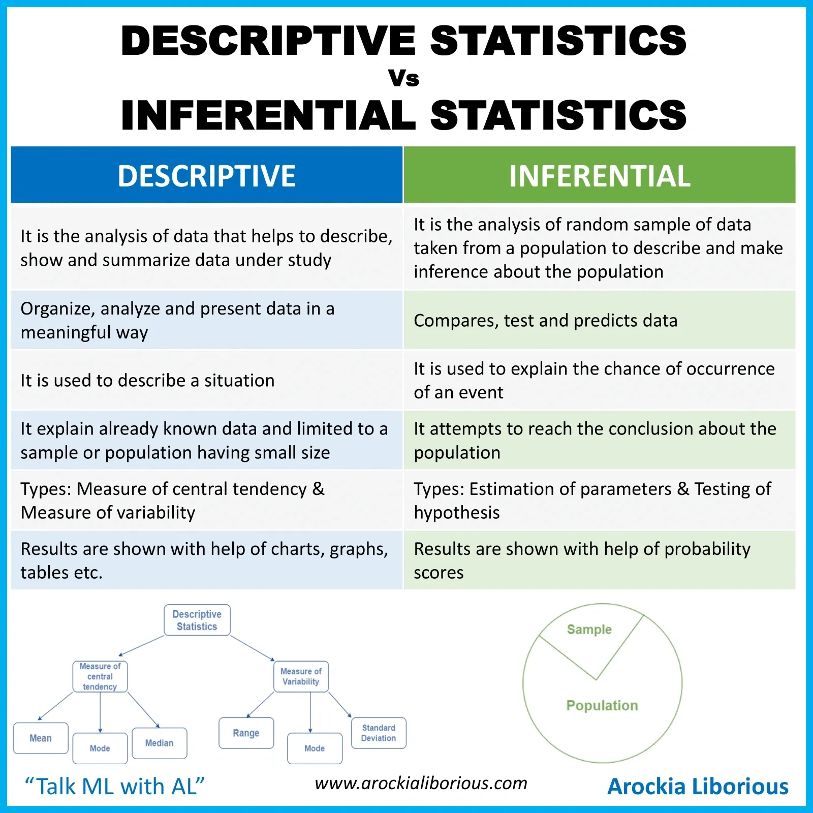
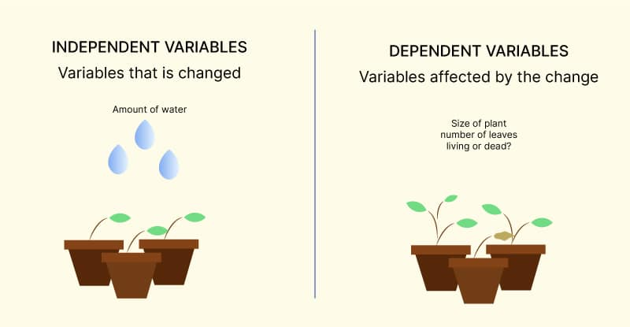
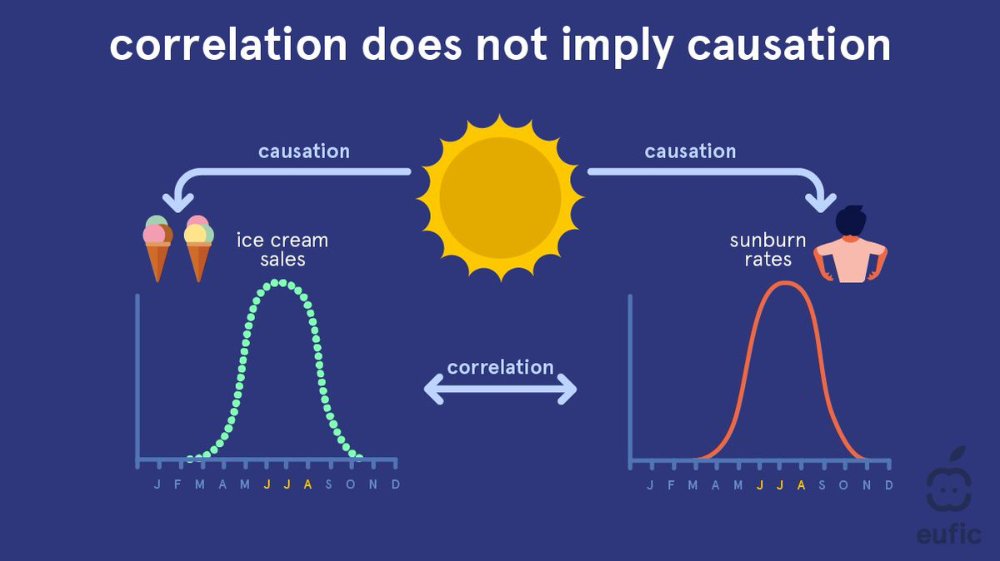
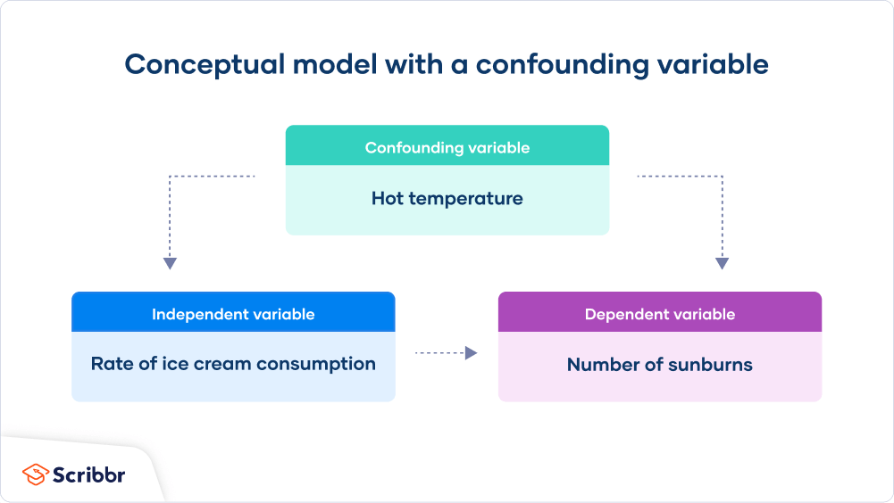
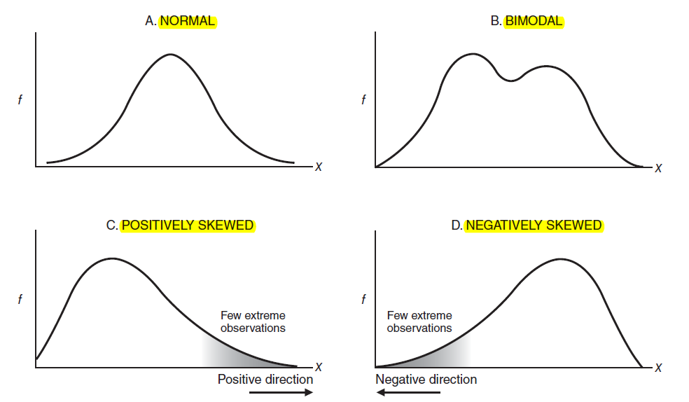
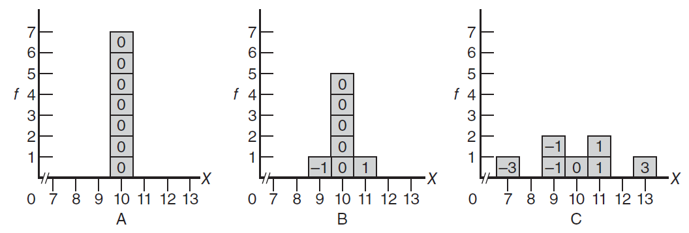
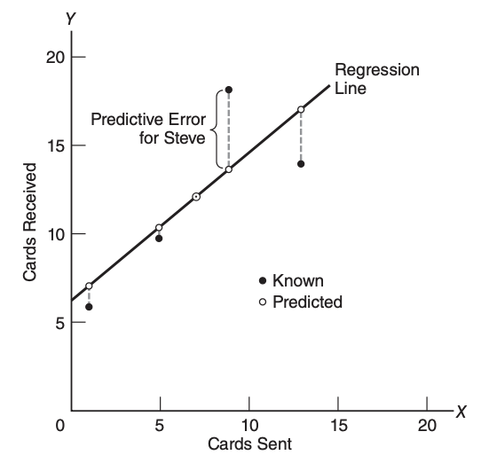

# What we will learn?
- [What we will learn?](#what-we-will-learn)
- [Basic Definition](#basic-definition)
- [Descriptive Statistics](#descriptive-statistics)
  - [Introduction](#introduction)
  - [Definitions](#definitions)
    - [Measures of Central Tendency](#measures-of-central-tendency)
    - [Variability](#variability)
    - [Measures of Variability](#measures-of-variability)
    - [Samples vs Population Variability Measures](#samples-vs-population-variability-measures)
    - [Degree of Freedom (df)](#degree-of-freedom-df)
    - [Normal Distribution](#normal-distribution)
    - [Variables Relationship](#variables-relationship)
    - [Correlation](#correlation)
    - [Regression](#regression)
      - [Standard Error of Estimate](#standard-error-of-estimate)
- [Inferential Statistics](#inferential-statistics)

# Basic Definition
- There are two types of statistics: 
 
Inferential statistics is concerned with generalizing beyond sets of actual observations, that is, with generalizing from a sample to a population. 
- In statistics, a **population** refers to any complete collection of observations or potential observations, whereas a **sample** refers to any smaller collection of actual observations drawn from a population.

- Level of Measurement:
 ](../images/stat-2.png)
- Independent vs Dependent Variables
  - In an experiment, an **independent variable** is the treatment manipulated by the investigator.
  - When a variable is believed to have been **influenced by the independent variable**, it is called a **dependent variable**. 
   
- Note that correlation does not imply causation
  
- **Confounding variable**: An uncontrolled variable that compromises the interpretation of a study is known as a confounding variable.

# Descriptive Statistics
## Introduction
- A **frequency distribution** is a collection of observations produced by sorting observations into classes and showing their frequency (f) of occurrence in each class. Guidelines for frequency distributions:
  - Each observation should be included in one, and only one, class.
  - List all classes, even those with zero frequencies.
  - All classes should have equal intervals.
  - (optional) All classes should have both an upper boundary and a lower boundary
  - (optional) The lower boundary of each class interval should be a multiple of the class interval.
  - (optional) Select the class interval from convenient numbers, such as 1, 2, 3, ..., 10, particularly 5 and 10 or multiples of 5 and 10.
  - (optional) Aim for a total of approximately 10 classes
- **Relative frequency distributions** show the frequency of each class as a part or
fraction of the total frequency for the entire distribution.
- **Cumulative frequency distributions** can be used effectively with sets of scores, such as test scores for intellectual or academic aptitude, **when relative standing within the distribution assumes primary importance**. Under these circumstances, cumulative frequencies are usually converted, in turn, to cumulative percentages. Cumulative percentages are often referred to as percentile ranks.
- **Qualtative Frequency Distribution**: Frequency distributions for qualitative data are easy to construct. Simply determine the frequency with which observations occupy each class, and report these frequencies
- **Outliers**: It requires special attention: 
   - check for accuracy
   - might exclude from summaries
   - might enhance understanding
- **Typical Shapes**: 
 
## Definitions
### Measures of Central Tendency
- The **mean** is the sum of all the values in a dataset divided by the number of values.
  - $\mu = \frac{1}{n} \sum_{i=1}^{n} x_i$
- The **median** is the middle value in a dataset when it is ordered from least to greatest.
  - For odd n: $Median = x_{\frac{n+1}{2}}$
   - For even n: $Median = \frac{x_{\frac{n}{2}} + x_{\frac{n}{2} + 1}}{2}$
- The **mode** is the value that appears most frequently in a dataset.

### Variability 
Statistics flourishes because we live in a world of variability; no two people are identical, and a few are really far out. When summarizing a set of data, we specify not only measures of central tendency, such as the mean, but also measures of variability, that is, measures of the amount by which scores are dispersed or scattered in a distribution.
 
- Three distributions with **the same mean (10)** but **different amounts of variability**. Numbers in the boxes indicate distances from the mean.
- Variabilities within groups assume a key role in inferential statistics. Briefly, the relatively smaller variabilities within groups translate into more **statistical stability**. On the other hand, the relatively larger variabilities within groups, translate into less statistical stability
  
### Measures of Variability
- **Range** is the difference between the maximum and minimum values in a dataset.
  -  **Instead of being a relatively stable measure of variability, the size of the range tends to vary with the size of the group.**
-  The most important spinoff of the range, the interquartile range (IQR), is simply the range for the middle 50 percent of the scores. More specifically, the IQR equals the distance between the third quartile (or 75th percentile) and the first quartile (or 25th percentile), that is, after the highest quarter (or top 25 percent) and the lowest quarter (or bottom 25 percent) have been trimmed from the original set of scores.
    **Notes:** 
    - Since most distributions are spread more widely in their extremities than their middle, the IQR tends to be less than half the size of the range.

    - A key property of the IQR is its resistance to the distorting effect of extreme scores, or outliers.
    - Thus, if you are concerned about possible distortions caused by extreme scores, or outliers, **use the IQR as the measure of variability**, along with the **median** (or second quartile) as **the measure of central tendency**.
- **Variance** measures how far each number in the dataset is from the mean.
  - Variance for **Population**: $\sigma^2 = \frac{\sum (x_i - \mu) ^ 2}{N}$ 
  - **Weakness of Variance**: In the case of a data of the weights of 53 male students, it is useful to know that the mean for the distribution of weights equals 169.51 pounds, but it is confusing to know that, because of the squared deviations, the variance for the same distribution equals 544.29 squared pounds. What, you might reasonably ask, are squared pounds?
- **Standard Deviation** is the square root of the variance and provides a measure of the spread of the data.
  - $S = \sqrt{\text{Variance}}$
  - You might find it helpful to think of the standard deviation as a rough measure of the average (or standard) amount by which scores deviate on either side of their mean.
  - A slightly different perspective makes the standard deviation even more accessible. For most frequency distributions, a majority (often as many as 68 percent) of all scores are within one standard deviation on either side of the mean.
  - For most frequency distributions, a small minority (often as small as 5 percent) of all scores deviate more than two standard deviations on either side of the mean.
  - **Note:** These two generalizations about the majority and minority of scores are independent of the particular shape of the distribution.
  - With rare exceptions, the standard deviation should be less than one-half the size of the range, and in most cases, it will be an even smaller fraction (one-third to one-sixth) the size of the range.
- **Z-Score**: a z score is a **unit-free**, standardized score that, regardless of the original units of measurement, indicates how many standard deviations a score is above or below the mean of its distribution.
  -  $z = \frac{X-\mu}{\sigma}$
  -  a positive or negative sign indicating whether it’s above or below the mean
  -   a number indicating the size of its deviation from the mean in standard deviation units.
  -   **Example:** A z score of 2.00 always signifies that the original score is exactly two standard deviations above its mean. Similarly, a z score of –1.27 signifies that the original score is exactly 1.27 standard deviations below its mean. A z score of 0 signifies that the original score coincides with the mean.

### Samples vs Population Variability Measures
Although the sum of squares ($SS$) term ($\sum (x_i - \bar{x})^2$)  remains essentially the same for both populations and samples, there is a small but important change in the formulas for the variance and standard deviation for samples. This change appears in the denominator of each formula where $N$, the population size, is replaced not by $n$, the sample size, but by $n − 1$, as shown:

- Variance for **Sample**: $s^2 = \frac{SS}{n-1}$

- Standard Deviation for **Sample**: $s = \sqrt{s^2} = \sqrt{\frac{SS}{n-1}}$

Using $n − 1$ in the denominator of standard deviation and variance solves a problem in inferential statistics associated with generalizations from samples to populations. The adequacy of these generalizations usually depends on accurately estimating unknown variability in the population with known variability in the sample. But if we were to use $n$ rather than $n − 1$ in the denominator of our estimates, they would tend to underestimate variability in the population because $n$ is too large. This tendency would compromise any subsequent generalizations, such as whether observed mean differences are real or merely transitory. On the other hand, when the denominator is made smaller by using $n − 1$, variability in the population is estimated more accurately, and subsequent generalizations are more likely to be valid.

### Degree of Freedom (df)
Degrees of freedom (df) refers to the number of values that are free to vary, given one or more mathematical restrictions, in a sample being used to estimate a population characteristic.
- The concept of degrees of freedom is introduced only because we are using scores in a sample to estimate some unknown characteristic of the population. Typically, when used as an estimate, not all observed values in the sample are free to vary because of one or more mathematical restrictions. As has been noted, when n deviations about the sample mean are used to estimate variability in the population, only $n − 1$ are free to vary. As a result, there are only $n − 1$ degrees of freedom, that is, $df = n − 1$. One df is lost because of the zero-sum restriction.

Variance for **Sample**: $s^2 = \frac{SS}{n-1} = \frac{SS}{df}$

Standard Deviation for **Sample**: $s = \sqrt{\frac{SS}{n-1}} = \sqrt{\frac{SS}{df}}$

where $s^2$ and $s$ represent the sample variance and standard deviation, $SS$ is the sum of squares as defined earlier, and $df$ is the degrees of freedom and equals $n − 1$.

### Normal Distribution
The familiar bell-shaped normal curve describes many observed frequency distributions, including scores on IQ tests, slight measurement errors made by a succession of people who attempt to measure precisely the same thing, etc.

**Properties of the Normal Curve:**

The properties of a Normal Curve, also known as a Gaussian distribution, are:

1. **Symmetry**: The normal curve is symmetrical, meaning its left half is a mirror image of its right half.

2. **Mean, Median, Mode**: The mean, median, and mode of a normal distribution are all equal and are located at the center of the distribution.

3. **Bell Shape**: The distribution has a bell shape, peaking at the mean and tapering off symmetrically on either side.

4. **Infinite Range**: The normal curve extends infinitely in both directions, but approaches but never touches the x-axis as it moves away from the mean.

5. **68-95-99.7 Rule**: Approximately 68% of the data falls within one standard deviation of the mean, 95% falls within two standard deviations, and 99.7% falls within three standard deviations. This is also known as the empirical rule.

6. **Dependence on Parameters**: The shape of the normal distribution is determined by the mean and the standard deviation. The mean determines the center of the distribution, and the standard deviation determines the spread of the distribution.

### Variables Relationship 
Relationships between pairs of variables can be categorized into:
- **Positive** Relationship: Two variables are positively related if pairs of scores tend to occupy similar relative positions (high with high and low with low) in their respective distributions
- **Negative** Relationship: Two variables are negatively related if pairs of scores tend to occupy dissimilar relative positions (high with low and vice versa) in their respective distributions.
- Little or No Relationship

In **dot cluster** graph: 
  - A dot cluster that has a slope from the lower left to the upper right reflects a **positive relationship**.
  - a dot cluster that has a slope from the upper left to the lower right reflects a **negative relationship**
  - a dot cluster that lacks any apparent slope reflects **little or no relationship**
  - The more closely the dot cluster approximates a straight line, the stronger (the more regular) the relationship will be. (In practice, perfect relationships are most unlikely.)
  - Sometimes a dot cluster approximates a bent or curved line and therefore reflects a curvilinear relationship.
### Correlation
Calculate a value for `r` by using the following computation formula:

**Correlation Coefficient:** $r = \frac{SP_{xy}}{\sqrt{SS_x SS_y}}$

where the two sum of squares terms in the denominator are defined as:

$SS_x = \sum(X - \bar{X})^2 = \sum X^2 - \frac{(\sum X)^2}{n}$

$SS_y = \sum(Y - \bar{Y})^2 = \sum Y^2 - \frac{(\sum Y)^2}{n}$

and the sum of the products term in the numerator, $SPxy$, is defined:

**Sum of Products:** $SP_{xy} = \sum(X-\bar{X})(Y-\bar{Y}) = \sum XY - \frac{(\sum X)(\sum Y)}{n}$

- Correlation measures the strength and direction of the linear relationship between two variables.
- The correlation coefficient, `r`, ranges from -1 to 1.
- A positive value of r indicates a positive correlation, while a negative value indicates a negative correlation.
- A value of 0 indicates no correlation.
- The value of r can’t be interpreted as a proportion or percentage of some perfect relationship.
- **`r` is Independent of Units of Measurement**
  > When interpreting a brand new r, you’ll find it helpful to translate the numerical value of r into a verbal description of the relationship. An r of .70 for the height and weight of college students could be translated into “Taller students tend to weigh more” (or some other equally valid statement, such as “Lighter students **tend to** be shorter”); an r of –.42 for time spent taking an exam and the subsequent exam score could be translated into “Students who take less time **tend to** make higher scores”; and an r in the neighborhood of 0 for shoe size and IQ could be translated into “**Little, if any, relationship exists** between shoe size and IQ.”
- **Correlation Not Necessarily Cause-Effect**: 
   >A correlation coefficient, regardless of value, never provides information about whether an observed relationship reflects a simple cause-effect relationship or some more complex state of affairs.

### Regression
Regression analysis is used to model the relationship between a dependent variable and one or more independent variables.
> if two variables are correlated, description can lead to a prediction

**Least Squares Regression Line**: A regression line, also known as the line of best fit, is a straight line that best represents the data on a scatter plot. This line may pass through some points, all of them, or none of them. It is used to study the nature of the relation between two variables. The goal of least squares regression line is to minimize the total predictive error.

In simple linear regression, the regression line is a straight line and its equation is of the form:
$$
Y^\prime = bX + a
$$

where:
- $Y^\prime$ is the predicted value,
- $X$ is the known value,
- $b$ is the slope of the line, and
- $a$ is the y-intercept.
- The slope $b$ represents the rate of change of $Y^\prime$ as $x$ changes. The y-intercept $a$ is the value of $Y^\prime$ when $X$ is $0$.

> The goal of the regression analysis is to find the values of $a$ and $b$ that make the line $a$ best fit for the data points.
> 
$$
a = \bar{Y} - b\bar{X} \\
b = r\sqrt{\frac{SS_y}{SS_x}}
$$
- $SS_x$ or $SS_y$ represents the sum of squares for all $X$ and $Y$ scores, respectively.
- $\bar{Y}$ and $\bar{X}$ refer to the sample means for all $Y$ and $X$.

- The coefficients in the regression equation represent the effect of each independent variable on the dependent variable.
- The coefficient of determination (R-squared) measures the proportion of the variance in the dependent variable that can be explained by the independent variables.
#### Standard Error of Estimate
The standard error of the estimate is a measure of the accuracy of predictions made with a regression line. It measures the accuracy of the predictions made by the regression line. The standard error of the estimate is given by (Definition Fromula):
$$
S_{y|x} = \sqrt{\frac{SS_{y|x}}{n-2}} =\sqrt{\frac{\sum(Y - Y^\prime)^2}{n-2}}
$$
- $SS_{y|x}$ is the sum of squares for predictive errors, $Y - Y^\prime$.
- $n -2$ is the degress of freedom.
The Standard Error of Estimate (Computation Frormula):
$$
s_{y|x} = \sqrt{\frac{SS_y(1-r^2)}{n-2}}
$$
- $r$ is the correlation coefficient between $X$ and $Y$.
- The closer $r$ is to 1, the smaller the standard error of the estimate will be. Conversely, the closer $r$ is to 0, the larger the standard error of the estimate will be.
- $r^2$ is the coefficient of determination, which measures the proportion of the variance in the dependent variable that can be explained by the independent variable.
- $r^2$ does not ensure cause-effect relationship, but it does provide a measure of the strength of the relationship between the variables.
- **Regression towards the Mean**
  > Regression toward the mean is a statistical phenomenon that occurs when a variable is extreme on its first measurement but closer to the mean or average on its second measurement. This is because the extreme value is likely to be caused by measurement error rather than a true change in the variable.
# Inferential Statistics

