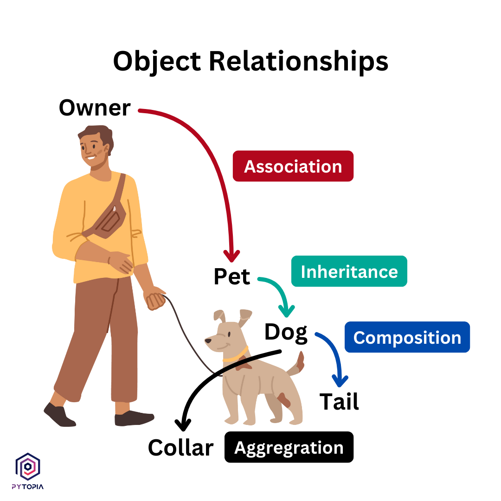

## Object Relationshops{#object_relationships}

- **Association**: Association is a broad term that encompasses any relationship between instances of two or more classes. It represents a "**uses-a**" relationship where objects of one class may use or have objects of another class, but without implying ownership or a parent-child relationship
  - **Example:** Consider the relationship between a `Doctor` and a `Stethoscope`. A `Doctor` uses a `Stethoscope`, but the existence and functionality of both are independent of each other. The Doctor can use other tools, and the `Stethoscope` can be used by other doctors, illustrating a flexible association between them.
- **Aggregation:** Aggregation is a specialized form of association that represents a "**has-a**" relationship, where the part can exist independently of the whole. It's a weaker relationship than composition, as it does not imply ownership of the parts by the whole.
  - **Example:** A `Department` can contain multiple `Professors`, but the `Professors` can exist independently of the `Department`. If the `Department` is destroyed, the `Professors` still exist.
- **Composition:** Composition is a strong form of association with a strict "part-a" relationship, implying ownership and lifecycle dependency between the whole and its parts. In composition, parts do not exist independently from the whole—if the whole is destroyed, its parts are also destroyed.
  - **Example:** A `Car` is composed of an `Engine`, `Wheels`, and `Body`. If the `Car` is destroyed, all its components are destroyed as well.
- **Inheritance:** Inheritance describes a hierarchical "is-a" relationship between a base class (superclass) and one or more derived classes (subclasses). It allows a subclass to inherit properties and methods from a superclass, establishing a clear, hierarchical classification of types.
  - **Example:** A `Vehicle` class can be a superclass, with `Car`, `Truck`, and `Motorcycle` as subclasses. Each subclass inherits common attributes and methods from the `Vehicle` class while adding its specific features.



### When to use each realationship{#when_to_use}
- **Composition** is used when objects have a strong "has-a" relationship, and the parts cannot exist independently of the whole. It implies a strong relationship where the parts are exclusive to the whole.
  - **Real-world Example:** A `Car` has a composition relationship with an `Engine` class, as the engine is an integral part of the car and cannot exist without it.
- **Aggregation** is used when objects have a "has-a" relationship, with a slight degree of dependence, yet where components can exist independently of the whole. It implies a weaker relationship where the parts can be shared among different wholes.
  - **Real-world Example:** A `Car` has an aggregation relationship with `Tire` classes, as tires can be used by multiple cars and exist independently of a specific car. 
- **Inheritance** is used when objects have an "is-a" relationship, where a subclass is a specialized version of a superclass. It establishes a hierarchical classification of types based on common attributes and behaviors.
  - **Real-world Example:** A `Dog` class may inherit from an `Animal` class, as a dog is a type of animal with specific attributes and behaviors.
- **Association** is used for a more general relationship between objects, where one object uses or interacts with another object. It represents a looser relationship without implying ownership or a hierarchical structure.
  - **Real-world Example:** A `Library` class may have an aggregation relationship with `Book` classes, as books can exist independently of the library. However, a `Library` may have a composition relationship with a `Librarian` class, as the librarian is part of the library and cannot exist without it.

The choice between these relationship types depends greatly on the particular design scenario and the desired system flexibility, scalability, and maintainability.

- **Flexibility:** Association and aggregation offer more flexibility as they allow objects to remain independent from one another, facilitating easier changes and extensions.

- **Control and Lifecycle Management:** Composition gives you more control over the parts since their lifecycle is tightly coupled with the whole. This is useful for strictly bounded entities but less flexible.

- **Code Reuse and Specialization:** Inheritance shines in scenarios requiring code reuse and specialization. It allows for defining a common interface for related objects while also customizing or extending their behavior

<a class="anchor" id="inheritance_in_python"></a>
## Inheritance in Python

**Inheritance** models what is called a **relationship**. This means that when you have a **Derived** or **Child** class that inherits from a **Base** or **Parent** class, you created a relationship where **Derived** or **Child** is a specialized version of **Base** or **Parent**, meaning one class takes on the attributes and methods of another.
Child classes can override or extend the attributes and methods of parent classes. In other words, child classes inherit all of the parent’s attributes and methods but can also specify attributes and methods that are unique to themselves.

**Note:** In an inheritance relationship:

- Classes that inherit from another are called derived classes, subclasses, or subtypes.
- Classes from which other classes are derived are called base classes or super classes.
- A derived class is said to derive, inherit, or extend a base class.

We have four different types of inheritance :
1. **Single**: A (Child) -> B (Parent)
    - Advantages: code reusability, simplicity, extensibility
    - Disadvantages: Not flexible
2. **Multi-level**: C (child B) -> B (Parent A, Child A) -> A (Parent)
   - Advantages: Organized structure, incremental enhancement, reusability and efficiency
   - Disadvantages: Increased complexity, coupling, risk of overriding issues
3. **Hierarchical**: C -> A | B -> A
   - Advantages: Code reusability and efficiency, ease of maintenance, organizational clarity
   - Disadvantages: Potential for code duplication, increased complexity
4. **Multiple** (less used): C -> A & C -> B
   - Complexities: The diamond problem, Method Resolution Order (MRO), conflicting methods


<a class="anchor" id="single_inheritance"></a>
### Single Inheritance

Version 2a and 2b are just examples to make the term of `super()` function more understandable.

```python

class Rectangle:
    def __init__(self, length, width):
        self.length = length
        self.width = width

    def area(self):
        return self.length * self.width

    def perimeter(self):
        return 2 * self.length + 2 * self.width

#version 1 - without inheritance
class Square:
    def __init__(self, length):
        self.length = length

    def area(self):
        return self.length * self.length

    def perimeter(self):
        return 4 * self.length

#version 2a - override __init__
class Square(Rectangle):
    def __init__(self, length):
        self.length = length
        self.width = length
        
#version 2b - override __init__ using upper class
class Square(Rectangle):
    def __init__(self, length):
        Rectangle.__init__(self,length, length)
                
#version 3 - using super()

# Here we declare that the Square class inherits from the Rectangle class
class Square(Rectangle):
    def __init__(self, length):
        #super()calling the parent class (Rectangle) constructor (__init__)
        super().__init__(length, length) 

                
square = Square(4)
square.area()
rectangle = Rectangle(2,4)
rectangle.area()
------ ANS -------
16
8
```
 The `super()` function is used to give access to methods and properties of a parent or sibling class. `super()` alone returns a temporary object of the superclass that then allows you to call that superclass’s methods.
Version 2.a and 2.b still work. But there is a problem! Here we are calling the parent class explicitly and we have a duplicate code. If during code development, the parent class changes, we have to update every place in code where we used the parent class name.
Python `super()` function allows us to refer the superclass implicitly. So, Python super makes our task easier and comfortable. While referring the superclass from the subclass, we don’t need to write the name of superclass explicitly, thus making the code more maintainable

<a class="anchor" id="multi-level_inheritance"></a>
### Multi-Level Inheritance

```python
class Square(Rectangle):
    def __init__(self, length):
        super().__init__(length, length)

class Cube(Square):
    def surface_area(self):
        face_area = super().area()
        return face_area * 6

    def volume(self):
        face_area = super().area()
        return face_area * self.length
    
    
cube = Cube(3)
cube.surface_area()
cube.volume()
--- ANS ---
54 
27
```

<a class="anchor" id="hierarchical_inheritance"></a>
### Hierarchical Inheritance

```python

class Shape:
    def __init__(self, color='Grey'):
        self.color = color
        
class Circle(Shape):
    """
    Circle class.
    """
    def __init__(self, r, color='Red'):
        super().__init__(color)
        self.r = r
        
    def area(self,):
        return 3.14 * self.r * self.r
    
    def perimeter(self,):
        return 2 * 3.14 * self.r

class Rectangle(Shape):
    def __init__(self, length, width, color='Green'):
        super().__init__(color)
        self.length = length
        self.width = width

    def area(self):
        return self.length * self.width

    def perimeter(self):
        return 2 * self.length + 2 * self.width

# Here we declare that the Square class inherits from the Rectangle class
class Square(Rectangle):
    def __init__(self, length, color='Yellow'):
        super().__init__(length, length, color)
        
class Cube(Square):
    def surface_area(self):
        face_area = super().area()
        return face_area * 6

    def volume(self):
        face_area = super().area()
        return face_area * self.length
    
c = Circle(3)
c.area(), c.perimeter(), c.color

--- ANS ---
(28.259999999999998, 18.84, 'Red')
```

The `Shape` class in the example above is what is called an `abstract` base class. Abstract base classes exist to be inherited, but never instantiated. Python provides the abc module to define abstract base classes.

<a class="anchor" id="multiple_inheritance"></a>
### Multiple Inheritance
Multiple inheritance **can be useful but also lead to very complicated situations and code that is hard to read**. It’s also rare to have objects that neatly inherit everything from more than multiple other objects. So we'll cover it as an optional section after covering a few basics of inheritance such as object hierarchy and abstract classes.


>Two built-in functions `isinstance()` and `issubclass()` are used to check inheritances. 
> Function `isinstance()` returns True if the object is an instance of the class or other classes derived from it.

```python
issubclass(derived, base)       # returns True
issubclass(base, drived)        # returns False

isinstance(object, derived)     # returns True
isinstance(object, base)        # returns True


isinstance(s, Square), isinstance(s, Rectangle)
isinstance(r, Rectangle), isinstance(r, Square)
issubclass(Square, Rectangle), issubclass(Rectangle, Shape), issubclass(Rectangle, Square)
-------- ANS ----------
(True, True)
(True, False)
(True, True, False)
```

## Abstract Base Classes (ABCs)
Abstraction is a fundamental concept in object-oriented programming. It allows you to hide the complex implementation details of a class and only show the necessary features of an object. 

The `Shape` class in the example above is what is called an `abstract` base class. Abstract base classes exist to be inherited, but never instantiated. Python provides the abc module to define abstract base classes.

The `abc` module in the Python standard library provides functionality to prevent creating objects from abstract base classes. You can modify the implementation of the Shape class to ensure that it can’t be instantiated:

```python
from abc import ABC, abstractmethod

class Shape(ABC):
    """
    Abstract shape class.
    """
    def __init__(self, color='Black'):
        print("Shape constructor called!")
        self.color = color
        
    def __str__(self, ):
        return f"Shape is {self.color}"
    
    @abstractmethod
    def area(self):
        pass
    
    @abstractmethod
    def perimeter(self):
        pass
```

You derive `Shape` from `ABC`, making it an abstract base class. Then, you decorate the `.area()` and `.perimeter()` methods with the `@abstractmethod` decorator.
This change has two nice side effects:

1. You’re telling users of the module that objects of type `Shape` can’t be created.
2. You’re telling other developers working on the other modules that if they derive from `Shape`, then they must override the `.area()` and `.perimeter()` abstract methods.

**Key features of the `abc` modlue in python:**
- Abstract base class support: The module allows for the creation of classes that cannot be instantiated, serving solely as a foundation for other classes
- Abstract method declaration: The `@abstractmethod` decorator enforces that derived classes must implement the abstract methods defined in the base class
- Runtime checks: The module provides runtime checks to ensure that abstract methods are implemented in derived classes, raising errors if they are missing

### Using the `abc` Module to Define Abstract Base Classes

‍‍‍‍1. **Import the `ABC` and `abstractmethod`**.
```python
from abc import ABC, abstractmethod
```
2. **Define your abstract base class**.
```python
class MyAbstractClass(ABC):
    @abstractmethod
    def an_abstract_method(self):
        pass
```

3. **Implement the abstract methods in the derived classes**.
```python
class ConcreteClass(MyAbstractClass):
    def an_abstract_method(self):
        print("Implementation of the abstract method")
```

> If a subclass doesn’t implement all the abstract methods, it cannot be instantiated and will raise an error indicating that abstract methods are missing.

The `abc` module is not just a theoretical construct but has practical applications in real-world software development:

- **Framework and Library Design:** In frameworks and libraries, where you need to provide a lot of flexible, extensible pieces that users can build upon, ABCs can dictate the methods and properties those extendable pieces must have.
- **Plugin Systems:** When developing plugin systems, ABCs can be used to define a clear contract for what each plugin should implement, making the system more robust and easier to work with.


<a class="anchor" id="composition"></a>
## Composition

**Inheritance** and **composition** are two important concepts in object-oriented programming that model the relationship between two classes. They are the building blocks of object-oriented design, and they help programmers to write reusable code.

Inheritance models what is called an **is a** relationship. Inheritance is represented using the [Unified Modeling Language](https://www.uml.org/).

- Let’s say you have a base class `Animal` and you derive from it to create a `Horse` class. The inheritance relationship states that a `Horse` **is an** `Animal`. This means that `Horse` inherits the interface and implementation of `Animal`, and `Horse` objects can be used to replace `Animal` objects in the application.

> This is known as the **Liskov substitution principle**. The principle states that “in a computer program, if `S` is a subtype of `T`, then objects of type `T` may be replaced with objects of type `S` without altering any of the desired properties of the program”.

Composition is a concept that models a **has a** relationship. It enables creating complex types by combining objects of other types. This means that a class Composite can contain an object of another class `Component`. This relationship means that a `Composite` **has a** `Component`.

- For example, your `Horse` class can be composed by another object of type `Tail`. Composition allows you to express that relationship by saying a `Horse` **has a** `Tail`.

Composition enables you to **reuse code by adding objects to other objects**, as opposed to inheriting the interface and implementation of other classes. Both `Horse` and `Dog` classes can leverage the functionality of Tail through composition without deriving one class from the other.

<a class="anchor" id="implementation_inheritance_vs_interface_inheritance"></a>
### Implementation Inheritance vs Interface Inheritance

When you derive one class from another, the derived class inherits both:

1. **The base class interface**: The derived class inherits all the methods, properties, and attributes of the base class.
2. **The base class implementation**: The derived class inherits the code that implements the class interface.

Most of the time, you’ll want to inherit the implementation of a class, but you will want to implement multiple interfaces, so your objects can be used in different situations. Modern programming languages are designed with this basic concept in mind. They allow you to inherit from a single class, but you can implement multiple interfaces.

```python
from abc import ABC, abstractmethod

class Shape(ABC):
    shape_id = 0
    
    def __init__(self, color='Black'):
        print("Shape constructor called!")
        self.color = color
        
    def __str__(self, ):
        return f"Shape is {self.color}"
    
    @abstractmethod
    def area(self):
        pass
    
    @abstractmethod
    def perimeter(self):
        pass
    
class Rectangle(Shape):
    def __init__(self, width, height, color='Black'):
        # You can also type `super(Rectangle, self)`
        super().__init__(color)

        print("Rectangle constructor called!")
        self.width = width
        self.height = height
        
    def area(self):
        return self.width * self.height
    
    def perimeter(self,):
        return 2 * self.width + 2 * self.height
    
    def calculate_areas(self, rectangles_list):
        areas = []
        for r in rectangles_list:
            areas.append()
            
        return areas
            
    def __str__(self,):
        return f"Rectangle is {self.color}"
    

    
r = Rectangle(3, 4)
---- ANS ----
Rectangle constructor called!    
```

To illustrate this, you will now add a `Temporary` class to the example above which doesn’t derive from `Shape`:
    

```python

class Temporary:
    def __init__(self, width, height):
        self.width = width
        self.height = height

    def area(self):
        return 999
```

The `Temporary` class doesn’t derive from `Shape` or `Rectangle`, but it exposes the same interface required by the `.calculate_areas()`. The `Rectangle.calculate_areas()` requires a list of objects that implement the following interface:

- A width property.
- A height property.

All these requirements are met by the `Temporary` class, so the `Rectangle` can still calculate its area.

```python

Rectangle.area(Temporary(3, 4))
---- ANS -----
12

--------------
Rectangle.area(Rectangle(3, 4))

---- ANS ----
Shape constructor called!
Rectangle constructor called!
12
```
As you can see, the `Rectangle` can still process the new object of `Temporary` class because it meets the desired interface (having width and height).

Since you don’t have to derive from a specific class for your objects to be reusable by the program, you may be asking why you should use inheritance instead of just implementing the desired interface. The following rules may help you:

- **Use inheritance to reuse an implementation**: Your derived classes should leverage most of their base class implementation. They must also model an **is a** relationship. A `Temporary` class might also have a width and a height, but a `Temporary` **is not** a `Shape`, so you should not use inheritance.

- **Implement an interface to be reused**: When you want your class to be reused by a specific part of your application, you implement the required interface in your class, but you don’t need to provide a base class, or inherit from another class.

>If you are not careful, inheritance can lead you to a huge hierarchical structure of classes that is hard to understand >and maintain. This is known as the **class explosion problem**.

**Composition** is an object-oriented design concept that models a **has a** relationship. In composition, a class known as **composite** contains an object of another class known to as **component**. In other words, a composite class **has a** component of another class.

Composition allows composite classes to reuse the implementation of the components it contains. The composite class doesn’t inherit the component class interface, but it can leverage its implementation.

The composition relation between two classes is considered **loosely coupled**. That means that changes to the component class rarely affect the composite class, and changes to the composite class never affect the component class. This provides better adaptability to change and allows applications to introduce new requirements without affecting existing code. When looking at two competing software designs, one based on inheritance and another based on composition, the composition solution usually is the most flexible. You can now look at how composition works.

**Example:**

```python

class Color:
    def __init__(self, name, hex, rgb):
        self.name = name
        self.hex = hex
        self.rgb = rgb
        
    def __str__(self):
        return f"{self.name} - HEX({self.hex}) - RGB{self.rgb}"
    
```
You can now add the `Color` to the `Rectangle` class through composition:

```python
r = Rectangle(3, 4, color=Color("Red", "D33817", (211, 56, 23)))
print(r.color)
------ ANS ------
Red - HEX(D33817) - RGB(211, 56, 23)
```

The `Rectangle` class leverages the implementation of the `Color` class without any knowledge of what an `Color` object is or how it’s represented. This type of design is so flexible that you can change the `Color` class without any impact to the `Rectangle` class.

<a class="anchor" id="choosing_between_inheritance_and_composition_in_python"></a>
### Choosing Between Inheritance and Composition in Python

Let’s say you have a class A that provides an implementation and interface you want to reuse in another class B. Your initial thought is that you can derive B from A and inherit both the interface and implementation. To be sure this is the right design, you follow theses steps:
1. **Evaluate B is an A:** Think about this relationship and justify it. Does it make sense?
2. **Evaluate A is a B:** Reverse the relationship and justify it. Does it also make sense?

If you can justify both relationships, then you should never inherit those classes from one another. Let’s look at a more concrete example.
You have a class `Rectangle` which exposes an .area property. You need a class `Square`, which also has an .area. It seems that a `Square` is a special type of `Rectangle`, so maybe you can derive from it and leverage both the interface and implementation.
Before you jump into the implementation, you use Liskov’s substitution principle to evaluate the relationship.
A Square **is a** Rectangle because its area is calculated from the product of its `height` times its `length`. The constraint is that `Square.height` and `Square.length` must be equal.
It makes sense. You can justify the relationship and explain why a `Square` **is a** `Rectangle`. Let’s reverse the relationship to see if it makes sense.
A `Rectangle` is a `Square` because its area is calculated from the product of its `height` times its `length`. The difference is that `Rectangle.height` and `Rectangle.width` can change independently.
It also makes sense. You can justify the relationship and describe the special constraints for each class. This is a good sign that these two classes should never derive from each other.

## Conclusion (Designing with Object Relationships){#conclusion}

#### Best Practices for Designing Object Relationships:

1) **Clearly Define Relationship Needs:** Before deciding on a relationship type, understand the nature of the interaction between objects. Distinguish between "uses-a," "has-a," and "is-a" relationships to choose between association, aggregation/composition, and inheritance, respectively.

2) **Prefer Composition Over Inheritance:** When possible, use composition to build classes from reusable components rather than relying on inheritance. This encourages encapsulation, leads to more flexible designs, and reduces tight coupling.

3) **Use Aggregation for Shared Lifecycles:** When you need a whole-part relationship without strictly binding the lifecycle of the parts to the whole, opt for aggregation. This provides clarity and aligns with real-world relationships where parts can exist independently from the whole.

4) **Implement Inheritance for True Hierarchical Relationships:** Employ inheritance for cases where a clear "is-a" relationship exists, ensuring that subclasses genuinely specialize the superclass. Leverage polymorphism to interchange objects of related classes seamlessly.

5) **Encapsulate Properly:** Ensure that objects encapsulate their data well and expose only necessary methods to other objects. Proper encapsulation hides complexity and keeps relationships clear and manageable.

6) **Maintain Low Coupling:** Design systems where objects are as independent as possible. This allows changes to one part of the system with minimal impact on others, fostering easier maintenance and scalability.

#### Avoiding Common Pitfalls in Designing Relationships
1) **Overusing Inheritance:** A common mistake is using inheritance where composition would suffice or be more appropriate. This can lead to fragile designs where changes to the base class cascade unnecessarily into subclasses.

2) **Misinterpreting Aggregation and Composition:** Failing to distinguish between when a part should exist independently from the whole (aggregation) versus when it shouldn’t (composition) tends to complicate the object lifecycle and dependencies.

3) **Neglecting Interface Segregation:** Avoid implementing large, monolithic interfaces that subclasses must inherit, even if they don't use all the methods. Favor smaller, more specific interfaces that classes can implement as needed.

4) **Circular Dependencies:** Be cautious of creating circular dependencies where two classes are dependent on each other. This complicates the system and makes it harder to understand and maintain.

5) **Ignoring Design Principles:** Principles like SOLID (especially the Liskov Substitution Principle for inheritance) guide effective OOP design. Ignoring these principles can lead to designs that are hard to extend or maintain.

6) **Excessive Use of Public Attributes and Methods:** This can lead to a higher degree of coupling between classes, making the system more rigid and less encapsulated. Aim for minimal necessary interaction exposure.

Sometimes, it’s hard to see what the relationship between two classes should be, but you can follow these guidelines:

- **Use inheritance over composition in Python**    
  - to model a clear **is a** relationship. First, justify the relationship between the derived class and its base. Then, reverse the relationship and try to justify it. If you can justify the relationship in both directions, then you should not use inheritance between them.
  - to leverage both the interface and implementation of the base class.

- **Use composition over inheritance in Python** 
  - to model a **has a** relationship that leverages the implementation of the component class.
  - to create components that can be reused by multiple classes in your Python applications
  - to implement groups of behaviors and policies that can be applied interchangeably to other classes to customize their behavior
  - to enable run-time behavior changes without affecting existing classes.