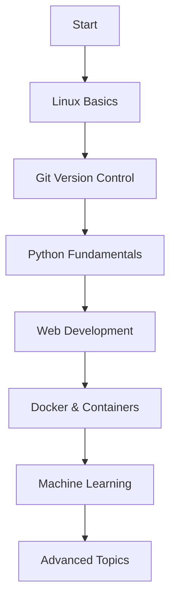

# 📚 Programming Notes

> A comprehensive collection of programming guides, cheat sheets, and learning resources for developers at all levels.

## 🎯 Overview

This repository serves as a complete reference guide for learning and mastering various programming technologies and tools. Whether you're a beginner starting your programming journey or an experienced developer looking for quick references, this collection has you covered.

## 📋 Table of Contents

- [� Programming Notes](#-programming-notes)
  - [🎯 Overview](#-overview)
  - [📋 Table of Contents](#-table-of-contents)
  - [🐍 Python Programming](#-python-programming)
    - [Core Python Topics](#core-python-topics)
    - [Object-Oriented Programming](#object-oriented-programming)
    - [File Operations \& Advanced Topics](#file-operations--advanced-topics)
  - [🤖 Machine Learning](#-machine-learning)
  - [🐧 Linux \& Command Line](#-linux--command-line)
  - [🌐 Web Development](#-web-development)
  - [🐳 Docker \& Containerization](#-docker--containerization)
  - [📝 Git Version Control](#-git-version-control)
  - [🗄️ SQL Database](#️-sql-database)
  - [📄 Markdown Documentation](#-markdown-documentation)
  - [🌐 Nginx Web Server](#-nginx-web-server)
  - [🚀 Getting Started](#-getting-started)
    - [Prerequisites](#prerequisites)
    - [How to Use This Repository](#how-to-use-this-repository)
    - [Recommended Learning Path](#recommended-learning-path)
  - [🤝 Contributing](#-contributing)
    - [How to Contribute](#how-to-contribute)
    - [Contribution Guidelines](#contribution-guidelines)
  - [📊 Repository Stats](#-repository-stats)
  - [📜 License](#-license)
  - [🙏 Acknowledgments](#-acknowledgments)

---

## 🐍 Python Programming

Comprehensive Python learning materials from basics to advanced concepts:

### Core Python Topics
- **[01. Basics](Python/01.%20Basics.md)** - Variables, syntax, and fundamental concepts
- **[02. Data Types](Python/02.%20Data%20Types.md)** - Strings, numbers, lists, dictionaries, and more
- **[03. Control Structures](Python/03.%20Control%20Structures.md)** - Loops, conditionals, and flow control
- **[04. List Comprehensions](Python/04.%20List%20Comprehensions.md)** - Elegant list creation and manipulation
- **[05. Printing Formats](Python/05.%20Printing%20Formats.md)** - String formatting and output techniques
- **[06. Functions](Python/06.%20Functions.md)** - Function definition, parameters, and scope
- **[07. Namespaces](Python/07.%20Namespaces.md)** - Variable scope and namespace concepts

### Object-Oriented Programming
- **[08. OOP - Basics](Python/08.%20OOP%20-%20Basics.md)** - Classes, objects, and basic OOP principles
- **[09. OOP - Inheritance & Composition](Python/09.%20OOP%20-%20Inheritance%20&%20Composition.md)** - Advanced OOP relationships
- **[10. OOP - Features](Python/10.%20OOP%20-%20Features.md)** - Polymorphism, encapsulation, and more

### File Operations & Advanced Topics
- **[11. Reading and Writing Files](Python/11.Reading%20and%20Writing%20Files.md)** - File I/O operations
- **[Extra Points](Python/Extra-points.md)** - Additional tips and advanced concepts
- **[Python Overview](Python.md)** - General Python reference

---

## 🤖 Machine Learning

Essential ML concepts and tools for data science:

- **[01. Sequences](ML/01.%20Sequences.md)** - Working with sequential data
- **[02. Numpy](ML/02.%20Numpy.md)** - Numerical computing with NumPy
- **[03. Statistics](ML/03.%20Statistics.md)** - Statistical foundations for ML
- **Interactive Notebooks** - Jupyter notebooks for hands-on practice

---

## 🐧 Linux & Command Line

Master the command line with comprehensive Linux guides:

- **[Linux Cheat Sheet](Linux%20Cheat%20Sheet.md)** - Detailed command reference
- **[Linux Cheat Sheet Summary](Linux%20Cheat%20Sheet%20Summary.md)** - Quick reference guide with categorized commands
  - Navigation & file operations
  - Text processing & search
  - Permissions & system management
  - Wildcards and pattern matching

---

## 🌐 Web Development

Frontend development fundamentals:

- **[01. Introduction](Web_Development/01.%20Introduction.md)** - Web development basics
- **[02. HTML](Web_Development/02.%20HTML.md)** - HTML structure and elements
- **Practical Examples** - Sample HTML files for reference

---

## 🐳 Docker & Containerization

Container technology and orchestration:

- **[Docker Guide](Docker.md)** - Comprehensive Docker reference
- **[Docker Compose Examples](Docker/)** - Multi-container application setups
  - `compose-2.yml` & `compose-3.yml` - Sample configurations
  - `Dockerfile` - Container build instructions
  - `template.yml` - Reusable templates

---

## 📝 Git Version Control

Essential version control with Git:

- **[Git Guide](Git.md)** - Complete Git workflow and command reference
- Branching strategies
- Collaboration workflows
- Best practices

---

## 🗄️ SQL Database

Database management and querying:

- **[SQL Reference](SQL.md)** - Comprehensive SQL guide
- Query optimization
- Database design principles

---

## 📄 Markdown Documentation

Master documentation with Markdown:

- **[Markdown Guide](Markdown.md)** - Complete Markdown syntax reference
- Formatting techniques
- Best practices for documentation

---

## 🌐 Nginx Web Server

Web server configuration and management:

- **[Nginx Guide](nginx.md)** - Server setup and configuration
- Performance optimization
- Security best practices

---

## 🚀 Getting Started

### Prerequisites
- Basic understanding of programming concepts
- A computer with terminal/command line access
- Text editor or IDE of your choice

### How to Use This Repository

1. **Browse by Topic**: Navigate to specific folders based on your learning goals
2. **Sequential Learning**: Follow the numbered guides for structured learning
3. **Quick Reference**: Use cheat sheets for rapid lookup of commands and syntax
4. **Hands-on Practice**: Utilize the provided examples and exercises

### Recommended Learning Path

---

## 🤝 Contributing

We welcome contributions to improve and expand these learning resources!

### How to Contribute
1. Fork the repository
2. Create a feature branch (`git checkout -b feature/new-guide`)
3. Add your content following the existing structure
4. Commit your changes (`git commit -m 'Add new programming guide'`)
5. Push to the branch (`git push origin feature/new-guide`)
6. Open a Pull Request

### Contribution Guidelines
- Follow the existing markdown formatting style
- Include practical examples where applicable
- Ensure content is beginner-friendly
- Add appropriate images or diagrams when helpful

---

## 📊 Repository Stats

- **Languages Covered**: Python, SQL, HTML, Shell/Bash
- **Tools & Technologies**: Git, Docker, Linux, Nginx, Machine Learning
- **Format**: Markdown documentation with practical examples
- **Level**: Beginner to Intermediate

---

## 📜 License

This project is open source and available under the [MIT License](LICENSE).

---

## 🙏 Acknowledgments

- Community contributors who help improve these resources
- Open source projects that inspire continuous learning
- The programming community for sharing knowledge

---

**Happy Learning! 🎉**

*Star ⭐ this repository if you find it helpful!*

